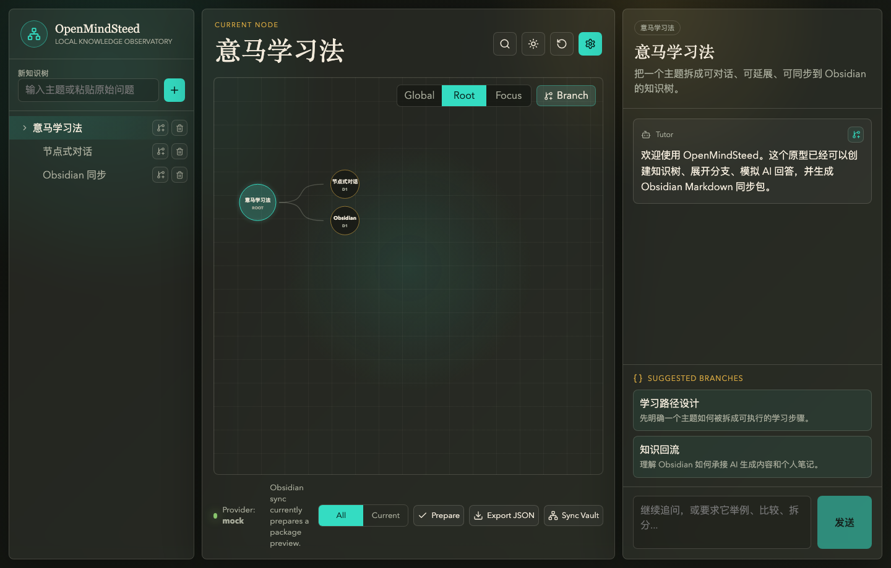

# OpenMindSteed

OpenMindSteed is an open-source React/TypeScript rebuild of MindSteed, a desktop-first knowledge learning app where users explore ideas as node-based conversations and sync the resulting knowledge tree into Obsidian.

The existing SwiftUI app at `/Users/teancumtian/Desktop/Creative/MindSteed` is the behavior reference. This repository is now the React/TS implementation track.



## Current Status

Implemented:

- Vite + React + TypeScript app foundation.
- Three-pane desktop workspace: tree, graph, and node conversation.
- Graph scope controls for Global, Root, and Focus views, plus graph-side branch creation.
- Command palette for node search and fast navigation.
- Local persisted demo state.
- Local OpenMindSteed backup export/import JSON, with provider secrets redacted.
- Playwright smoke test for the main workspace and screenshot attachment.
- Tauri SQLite state command contract with schema migration tracking and browser fallback persistence.
- Node CRUD, suggested branch expansion, selected-answer branch expansion, and streamed mock AI responses.
- Seeded roots and pending child branches automatically start their first learning turn through the selected provider.
- Stoppable streaming responses through AbortSignal, including Codex Local cancellation by request id.
- AI provider contract with Mock, BYOK Direct, and Codex Local provider paths.
- BYOK Direct validates API key, endpoint, and model before sending provider requests.
- BYOK Direct provider presets for DeepSeek, Qwen/DashScope, Z.AI/Zhipu GLM, Kimi/Moonshot, and Doubao/Volcengine Ark.
- BYOK Web search adapters for Qwen/DashScope `enable_search`, Z.AI GLM `web_search`, Kimi `$web_search` tool-call loops, and Doubao/Volcengine Ark Responses `web_search`.
- BYOK image generation adapter for Z.AI GLM-Image, rendered as structured image messages and persisted locally in the Tauri desktop app.
- Obsidian Markdown package generator with managed block merge tests.
- Tauri v2 project structure, Obsidian sync write command, SQLite state store with migration tracking, OS keychain command contract, and Codex app-server adapter.
- Codex Local streams Tauri app-server deltas into React and persists one Codex thread mapping per OpenMindSteed node.
- Codex Local falls back to completed agent-message payloads when a Codex version does not stream text deltas.
- Codex Local parses an explicit response metadata block for title, summary, and suggested branches, with heuristic fallback.
- Codex Local reports and stops a learning turn if Codex tries to perform local command, tool, file, diff, patch, or shell work.
- Codex Local reports whether a node thread was started, resumed, or rebuilt after a resume failure.
- Codex Local status check for binary/version/login diagnostics in the desktop settings panel.
- Codex Local setup diagnostics include install/path actions when the binary is missing and `codex login` guidance when signed out.
- Codex Local compatibility warning for Codex CLI versions outside the tested `>=0.142.0 <0.143.0` range.
- Reproducible Codex app-server protocol type generation through `pnpm run codex:protocol`.
- Tauri folder picker for selecting the Obsidian vault path.
- Obsidian manifest pruning moves renamed or removed managed files into `_Deleted/<sync-batch>/...`.
- Obsidian sync copies generated image assets into each tree's `Assets/` folder and rewrites embeds to vault-relative paths.
- Example Obsidian vault export under `docs/example-vault/`.
- App icon source copied from the original MindSteed AppIcon, with generated Tauri icon set for desktop bundles.
- Tauri frontend capabilities are restricted to dialog access; local filesystem writes and Codex process execution are handled by reviewed Rust commands instead of broad frontend fs/shell plugin permissions.
- Repeatable `pnpm run secrets:check` guardrail for common credential files, private key blocks, Codex token assignments, and provider-token patterns.
- MIT license, contribution guide, issue/PR templates, GitHub CI, and GitHub release workflow.

Pending:

- Additional vendor-specific image adapters and provider-specific search refinements.
- Codex Local hardening: richer failure-specific recovery and structured extraction refinements.
- Apple signing/notarization secret setup and first public release validation.

## Run

```bash
git clone https://github.com/TeancumTian/OpenMindSteed.git
cd OpenMindSteed
corepack enable
pnpm install
pnpm run dev
```

Then open the Vite URL shown in the terminal.

For the desktop shell:

```bash
pnpm run tauri:dev
```

## Verify

```bash
pnpm run format:check
pnpm run lint
pnpm run typecheck
pnpm run test
pnpm run test:e2e
pnpm run build
```

`pnpm run tauri:dev` requires Rust and the Tauri toolchain. The backend is verified with `cargo check` in `src-tauri`, and debug app bundles can be produced with `pnpm exec tauri build --debug --bundles app`.

## AI Providers

- `Mock Tutor`: default local provider for development.
- `BYOK Direct`: OpenAI-compatible `/chat/completions` provider. Users bring their own API key.
- `Codex Local`: experimental provider that starts locally signed-in Codex app-server over stdio. OpenMindSteed must not read `~/.codex/auth.json`, store `CODEX_ACCESS_TOKEN`, or implement ChatGPT OAuth itself.

BYOK presets fill endpoint/model defaults and expose only implemented tool adapters. Web search is currently enabled for Qwen/DashScope, Z.AI GLM, Kimi/Moonshot, and Doubao/Volcengine Ark presets; Doubao web search uses the Ark Responses API while normal chat still uses Chat Completions. Image generation is currently enabled for the Z.AI GLM-Image adapter. In the Tauri desktop app, generated image URLs are downloaded into local app data and rendered through Tauri's asset protocol.

## Obsidian Sync

The current implementation generates the planned Markdown package shape and includes a Tauri command for writing it to a vault. In browser preview, use `Export JSON`; in Tauri desktop runtime, `Sync Vault` calls the backend writer. The sync strip can export/sync all trees or only the current root tree.

Generated content preserves user notes through a managed block contract:

```md
<!-- mindsteed:managed:start -->

...

<!-- mindsteed:managed:end -->
```

When a previously managed Markdown file is no longer part of the active sync scope, the Tauri backend moves it to `_Deleted/<sync-batch>/...` and keeps a deleted manifest entry instead of permanently removing it.

See:

- [Implementation plan](docs/OPENMINDSTEED_PLAN.md)
- [Backup and restore](docs/backup-restore.md)
- [Provider presets](docs/provider-presets.md)
- [Obsidian sync](docs/obsidian-sync.md)
- [Example Obsidian vault](docs/example-vault/Index.md)
- [Codex Local Provider](docs/codex-local-provider.md)
- [Testing](docs/testing.md)
- [Release](docs/release.md)
- [Security policy](SECURITY.md)
