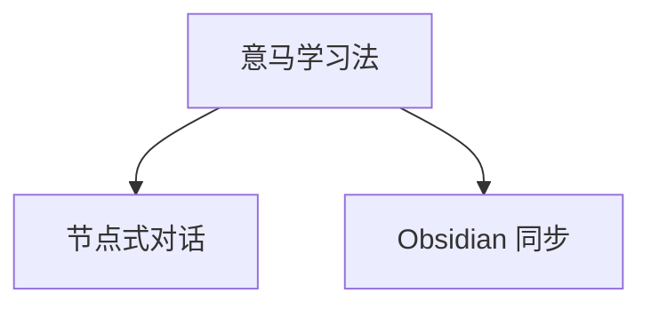

<!-- mindsteed:managed:start -->
---
mindsteed_export: true
mindsteed_root_id: "root-mindsteed"
mindsteed_exported_at: "2026-06-23T17:00:00.000Z"
tags:
  - mindsteed
  - mindsteed/tree
---

# 意马学习法

> 把一个主题拆成可对话、可延展、可同步到 Obsidian 的知识树。

- Nodes: 3
- Exported: 2026-06-23T17:00:00.000Z

## Tree

## Nodes

- [[Nodes/01-意马学习法-rootmind|意马学习法]]
  - [[Nodes/02-节点式对话-dialogue|节点式对话]]
  - [[Nodes/03-Obsidian 同步-obsidian|Obsidian 同步]]
<!-- mindsteed:managed:end -->

## My Notes

Use this file as the tree overview when opening `docs/example-vault` as an Obsidian vault.
